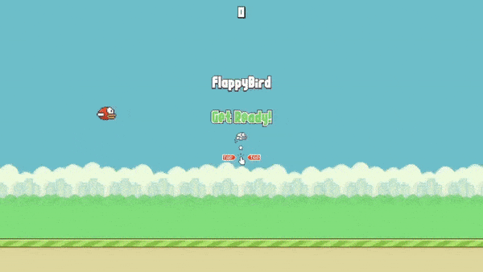

<div align="center" style="margin-bottom: 20px">

  

   <h2 align="center">
    Flappy Bird - Javascript
  </h2>

</div>

Simple Flappy Bird game application using plain javascript and webpack as module bundler!

# Installing

Clone the repository

```console
$ git clone https://github.com/gstcarv/js-flappy-bird
```

Install the dependencies and start

```console
$ npm install
$ npm start
```

# Preview




## Thanks

with ❤️ by Gustavo
